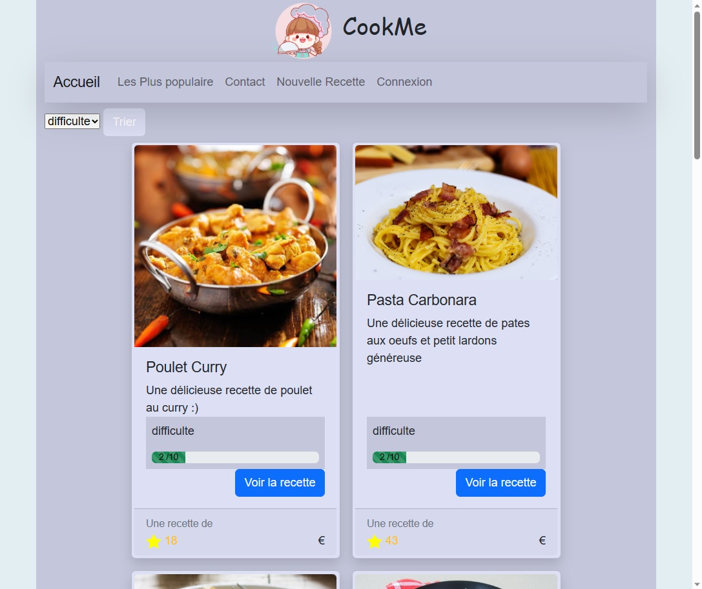
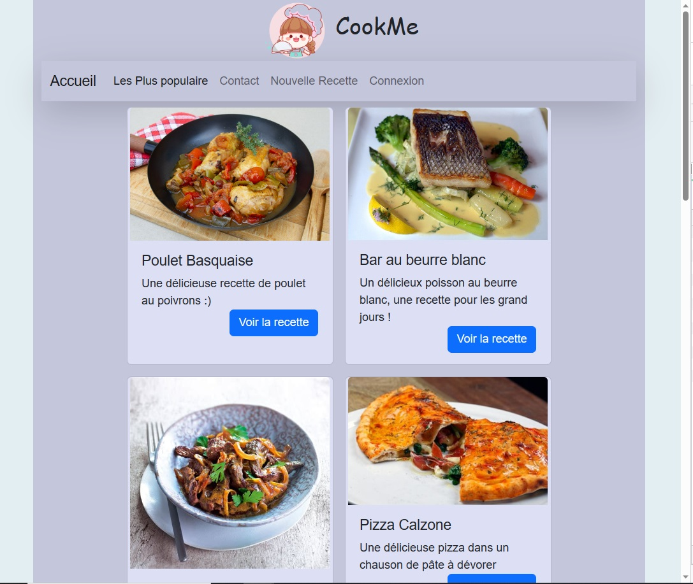
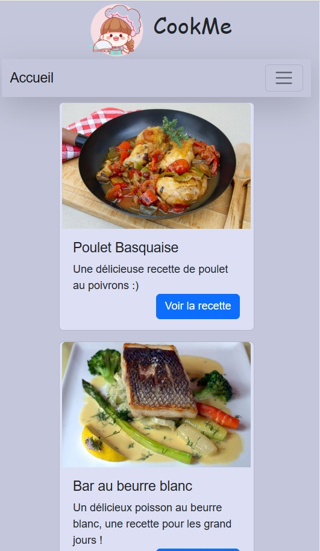
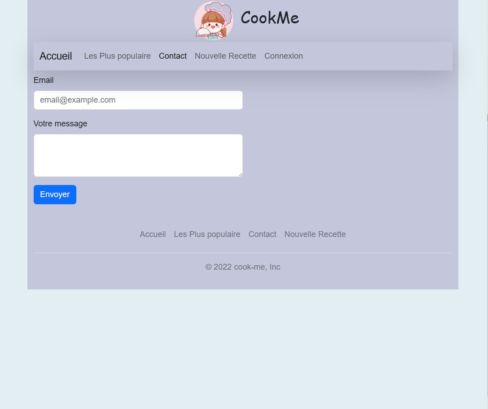
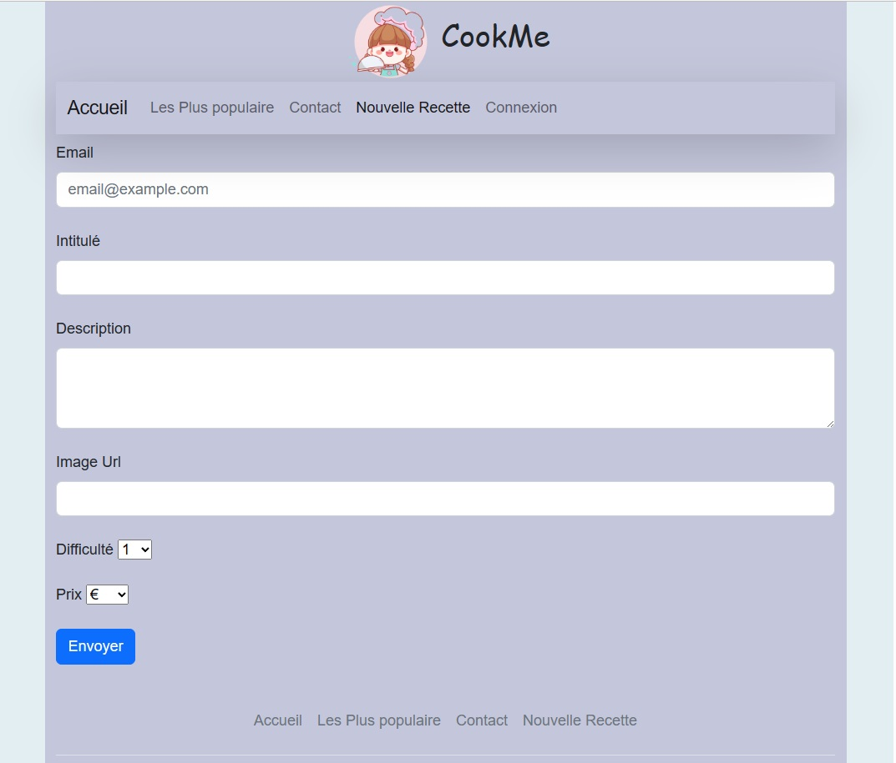

# COOK-ME 
# Projet de mise en pratique de differents apprentissages

## Objectif de ce projet:

- révision des bases PHP:
    - variables
    - urls
    - affichages
    - boucles & conditions
    - tableaux de données
    - inclusions
    - traitement des formulaires
- Base de données (MySql):
    - installer et parametrer une base de données
    - connecter notre base de données à notre projet PHP 
    - requetes SQl
    - requetes préparées
    - sécurité : éviter les injections SQL
- Session et cookies

## Quelques captures d'écran du projet réalisé:
> utilisation de Bootstrap pour le style

#### Accueil :  
  
#### Les plus populaires :  
  
#### Les plus populaires avec un affichage adapté au smartphone:  
  
#### Contact :  
  
#### Ajouter une nouvelle recette :  
 